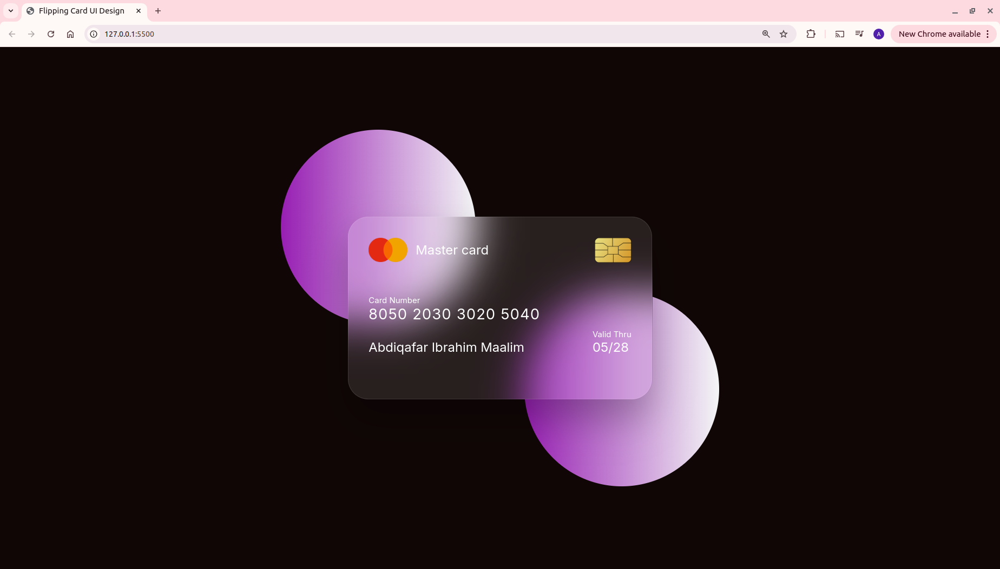

```markdown
## Flipping Card UI Design



---

## 🚀 Overview
A modern, glassmorphic “flipping card” component showcasing a credit-card style front and back face. Built with pure HTML and CSS (no JavaScript), this component uses 3D transforms, backdrop-filter blur, and smooth transitions to create an interactive UI element ideal for dashboards, profile cards, or payment-method previews.

---

## ✨ Demo
1. Clone or download this repo.
2. Open `index.html` in your browser.
3. Hover over the card to see it flip smoothly.

---

## 📂 Project Structure
```

/project-root
│
├── index.html          # Markup for front and back card faces
├── styles.css          # Glassmorphic styling, 3D transforms, and layout
├── logo.png            # Placeholder logo image
├── chip.png            # Placeholder chip image
└── Flipping-card.png   # Screenshot for README/demo

````

---

## 🔧 Installation
1. **Clone** the repository  
   ```
   git clone https://github.com/yourusername/flipping-card-ui.git
   cd flipping-card-ui
````

2. **Open** `index.html` in any modern browser (Chrome, Firefox, Safari, Edge).

*No build tools or dependencies required.*

---

## 📋 Usage

* **Hover** over the card container to trigger the flip animation.
* **Customize** text, images, and colors directly in the HTML/CSS:

  * Change `.number` and `.name` in `index.html`.
  * Adjust theme colors in `styles.css` under `:root` variables (if you introduce them).
* **Embed** this component as a section in your own pages by copying the `<section>…</section>` block and CSS.

---

## 🎨 Design Details

* **Perspective & 3D**
  The parent `<section>` uses `perspective: 1000px` to create depth.
  The `.container` flips on hover via `transform: rotateY(180deg)`.

* **Glassmorphism**
  Semi-transparent backgrounds (`rgba(255,255,255,0.1)`) plus `backdrop-filter: blur(25px)` deliver the frosted-glass effect.

* **Responsive Sizing**
  Card dimensions (375×225px) chosen for mobile/tablet preview; adjust in CSS to fit your layout.

* **Accessibility**
  All text uses the “Inter” font for clarity. Alt attributes provided for images.

---

## 🛠️ Technologies

* **HTML5** — semantic markup for front/back faces
* **CSS3** — Flexbox layout, transforms, transitions, and backdrop filters
* **Google Fonts** — [Inter](https://fonts.google.com/specimen/Inter)

---

## ⚙️ Browser Support

| Feature                       | Chrome | Firefox | Safari | Edge |
| ----------------------------- | :----: | :-----: | :----: | :--: |
| CSS 3D Transforms (`rotateY`) |   ✔️   |    ✔️   |   ✔️   |  ✔️  |
| `backdrop-filter: blur()`     |   ✔️   | Partial |   ✔️   |  ❌\* |

*\* Edge currently requires the “Enable experimental Web Platform features” flag.*

---

## 🤝 Contributing

1. Fork this repo.
2. Create a new branch: `git checkout -b feature/my-flip-card`.
3. Commit your changes: `git commit -m "Add cool feature"`.
4. Push to origin: `git push origin feature/my-flip-card`.
5. Open a Pull Request.

---

## 📄 License

This project is licensed under the MIT License. See [LICENSE](LICENSE) for details.

```
```
